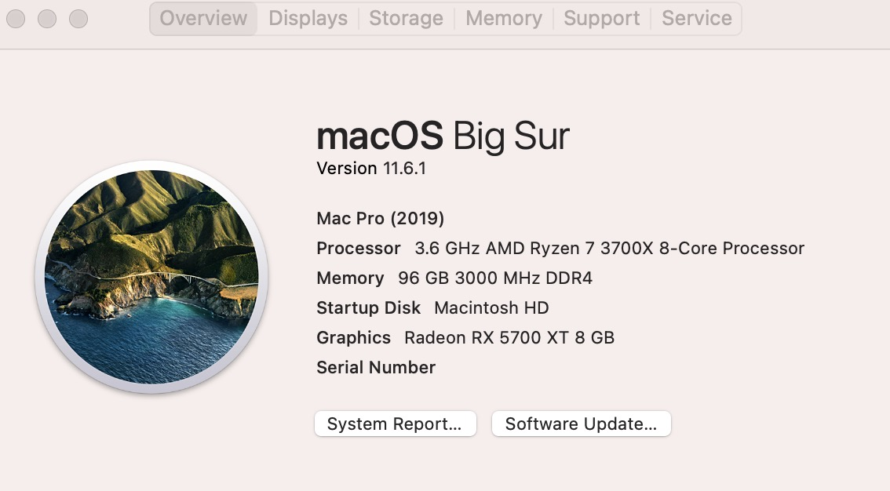

# Hackintosh-OpenCore-MSI-B550-CARBON-WIFI-EFI
OpenCore EFI files for MSI B550 CARBON WIFI

Most credits go to https://github.com/ybakiame/Hackintosh-Opencore-MAG-MSI--B550M-MORTAR-WIFI-EFI

### WARNING: BigSur ONLY,  Monterey has boot issues

## Specification

| **Component**    | **Model**                       | **Driver/File/Args used**    |
| -----------------| --------------------------------| ----------------------------|
| CPU | AMD Ryzen R7 3700X |  |
| Motherboard| MSI B550 CARBON WIFI | SSDT-CPUR |
| RAM| Cuso 16/32GB DDR4 3000 x 2 | |  
| Audio Chipset | ALCS1200A | AppleALC with alcid=7 |
| GPU              | HIS RX5700XT 8G  | WhatEverGreen with agpdmod=pikera |
| Ethernet         | RTL8125B 2.5GbE  | LucyRTL8125Ethernet |
| WiFi & Bluetooth | Intel WiFi 6 AX200 (not used)   | Disabled, seems to prevent booting sometimes |
| OS Disk(nvme)    | AppleSME 256G(from old macbook) |  |

## What's working

* GPU, HiDPI enabled by default
* Ethernet working in 2.5G
* Sleeping seems to be working fine, but not tested since I don't care.

## What's NOT working

* No sound from speaker after booting into Windows, adding alctsel=1 doesn't help, have to poweroff one time to make the sound working again. Even though, HDMI sound work all the time even after a Windows boot
* Wifi/Bluebooth disabled since I don't use them on desktop, and sometimes cause boot lockups
* USBMap has been done, but seems cause boot lockups sometimes, so I just leave it in the Kexts folder disabled for reference.
* Monterery

## Show off time :P

